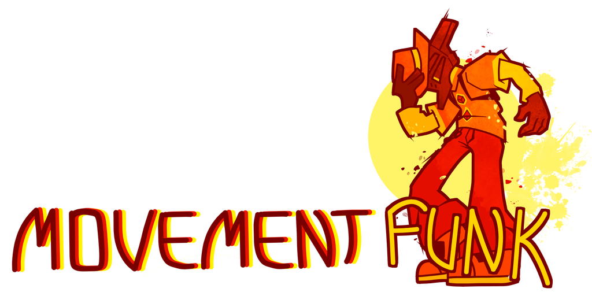

<p align="center"></p>

<p style="text-align: center;">MovementFunk is a fork of <a href="https://github.com/yurilewd/BRC-MovementPlus">MovementPlus</a> that has the same goals as the orinal MovementPlus: faster and more rewarding gameplay.</p>
<p style="text-align: center;">As with the orininal M+, any of the features included can be tweaked or outright disabled via the config file.</p>


## Known Incompatible Mods
DontSetMySpeedPLS - using this won't crash the game, but it does break multiple mechanics for both mods.
MovementPlus - MF and M+ are basically the same mod, and using them together will result in a crash.


## More Vanilla?
If you want something closer to vanilla you can use this VanillaPlus config Yuri made [here](https://github.com/yurilewd/BRC-MovementPlus/blob/main/Thunderstore/VanillaPlusConfig/com.yuril.MovementPlus.cfg), to use this file you need to click the "Download raw file" button and then save that into your \BepInEx\config folder, if it asks you to overwrite an existing file you should do so.


## Installation
If you're looking to build the mod on your own, go to [Building](#building)

### Using r2modman(recommended)
- Download [r2modman](https://thunderstore.io/c/bomb-rush-cyberfunk/p/ebkr/r2modman/)
- Download BepInEx through r2modman
- [Build](#building) MovementFunk (thunderstore release when?)
- Put the built .dll in ``Thunderstore\Plugins\MovementFunk`` and zip everyting that is inside ``Thunderstore\``
(or just run ./package.sh if you're on linux)
- Import the zip using r2modman (Settings -> Profile -> Import Local Mod)

### Manual
- Ensure you have [built](#building) MovementFunk. I don't have any built releases yet unfortunately.
- Ensure you have BepInEx 5.4.21 installed, if you do not have that installed you can find it [here](https://github.com/BepInEx/BepInEx/releases/tag/v5.4.21)
- Navigate to the Bomb Rush Cyberfunk folder, if you have the steam version it is located at this path "Program Files\Steam\steamapps\common\BombRushCyberfunk"
- Place the MovementFunk.dll into the \BepInEx\plugins folder, if you have BepInEx installed correctly this folder should already exist
- Launch the game<br>

## Building
- First of all, clone the repository if you haven't already:
```
git clone https://github.com/shibowo/BRC-MovementFunk.git
```
- Go inside the generated MovementFunk directory(this is not the config directory):
```
cd MovementFunk
```
- Make sure you have a publicized version of the game's Assembly-CSharp.dll
You can use [CabbageCrow's AssemblyPublicizer](https://github.com/CabbageCrow/AssemblyPublicizer) (windows only) or my port of it, [AssemblyRePublicizer](https://github.com/shibowo/AssemblyRePublicizer) (works on all platforms that support .net) for the publicizing. The Assembly-CSharp.dll itself can be found inside {gameroot}\Bomb Rush Cyberfunk_Data\Managed ({gameroot} is wherever the BombRushCyberfunk folder is, including that folder). After publicizing, put the publicized .dll in ``lib\`` as ``Assembly-CSharp_publicized.dll``
- Make sure you have these DLL's too (no need to publicize these):
(if you are on linux, you can just run ``./source_dlls.sh``.)
```
From Bomb Rush Cyberfunk_data\Managed:
Assembly-CSharp-firstpass.dll
UnityEngine.dll
UnityEngine.AnimationModule.dll
UnityEngine.AudioModule.dll
UnityEngine.CoreModule.dll 
UnityEngine.IMGUIModule.dll
UnityEngine.InputLegacyModule.dll
UnityEngine.ParticleSystemModule.dll
UnityEngine.PhysicsModule.dll

From BepInEx\ :
core\0Harmony.dll
core\BepInEx.dll
plugins\LazyDuchess-CommonAPI/CommonAPI.dll
```
You should copy those dlls to ``lib\``.

- After gathering all the DLLs you can build the mod with(you need to have the .NET SDK installed):
```
dotnet build
```
The built DLL should be in ``bin\Debug\netstandard2.0\MovementFunk.dll``.

## Configuration
There are multiple ways to edit the config, make sure you've run the game with the mod at least once<br><br>

- The simplest is to just use the built in config editor in r2modman to edit the config<br>

- You can edit it manually, you can find the config file in the \BepInEx\config folder, it should be named com.yuril. MovementPlus.cfg<br>

- You can use [this tool](https://github.com/BepInEx/BepInEx.ConfigurationManager) to edit the values in-game in real time, some changes may only take effect on entering a new area


## Credits
Huge thanks to these individuals, this mod would not be the same without them.

People that worked on MovementFunk:
- shibowo (me) for picking up M+ and forking it into MF
- Queen2222 for the MovementFunk banner and icon
- Thunder_Kick (Project Lead)
- Yoshi (Lead Playtester)

People that worked on MovementPlus:
- YuriLewd ("And Yuri said, "Let there be MovementPlus" and there was MovementPlus." -Genesis 1:3)
- RackBox
- FracturedStar
- LIMBSMITH
- Lazy Duchess
